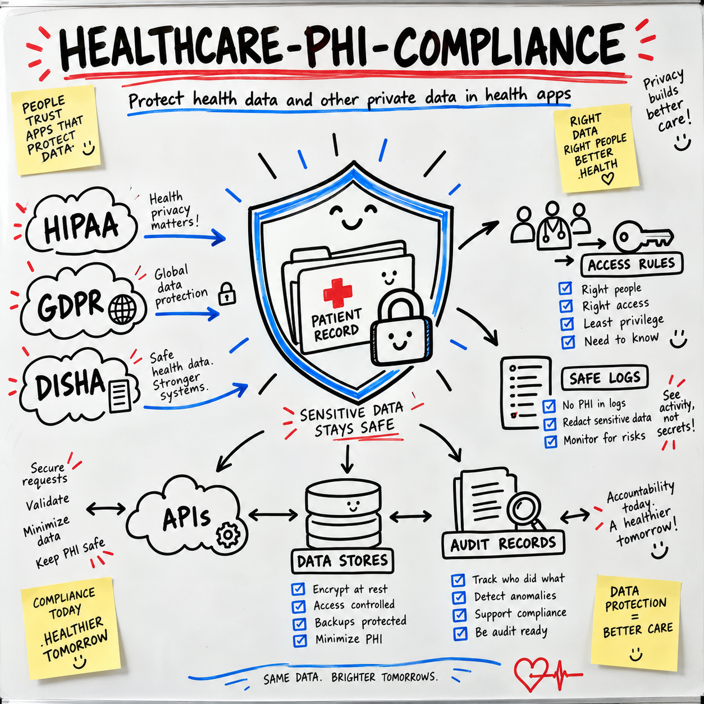

# health-data-guard-plus



   

> **Built on [affaan-m/ECC](https://github.com/affaan-m/ECC)** by @affaan-m (257,816 stars, MIT). All credit for the original idea to them. This fork improves and repackages it; upstream license preserved in [UPSTREAM_LICENSE](UPSTREAM_LICENSE).

**A Claude Code skill that helps developers find and fix health data risks in apps before private data leaks.**

Built for developers who work with patient, staff, payment, or sign-in data. It fits into your current Claude Code flow and has no extra tools to install.

## 🩺 Why

Health apps hold some of a person's most private data.

One weak API, log, export, or access rule can expose it. A removed name may not be enough to make a record safe. Dates, places, faces, voices, and rare facts can still point to one person.

This skill gives Claude Code a clear review path. It checks what data a feature uses, why it needs it, who may see it, and where it may leak.

It supports work linked to HIPAA, GDPR, DISHA, and similar rules. It is a safe base, not legal advice.

## 🚀 Install

```bash
curl --create-dirs -o ~/.claude/skills/healthcare-phi-compliance/SKILL.md https://raw.githubusercontent.com/health-data-guard-plus/health-data-guard-plus/main/skill/SKILL.md
```

## 💬 Usage

Ask Claude Code to review a feature:

```text
Use the healthcare-phi-compliance skill to review this patient export API.
Check access rules, logs, audit records, tenant safety, and data leaks.
```

Expected output:

```text
Private data found:
- Patient name
- Date of birth
- Lab results

Main risks:
- The client sends the facility ID
- Export events are not added to the audit log
- The error response includes a raw database message

Next fixes:
1. Read the facility ID from trusted server data.
2. Add a server-side export rule.
3. Record the export without copying patient values.
4. Return a safe error with a random request ID.
5. Test a user from another tenant.
```

The skill follows three core steps:

1. Classify private data.
2. Control who may use it.
3. Audit access and changes.

It also checks backups, test data, retention, outside services, urgent access, and common leak paths.

## 🔧 What we changed vs upstream

- Rewrites the Japanese metadata and dense prose into clearer English, while adding an explicit legal-advice disclaimer.
- Broadens coverage beyond basic PHI access to biometrics, re-identification risk, backups, test data, retention, incident response, exports, and third-party services.
- Turns the three-layer model into concrete privacy principles and a step-by-step feature review workflow.
- Strengthens access-control guidance with forced RLS, server-side identity checks, per-operation policies, cross-tenant testing, and warnings about privileged bypasses.
- Introduces urgent “break-glass” access guidance, which the original did not address.

## 📄 License

MIT licensed. The upstream MIT license is preserved in [UPSTREAM_LICENSE](UPSTREAM_LICENSE). This skill was contributed by Health1 Super Speciality Hospitals and Dr. Keyur Patel.